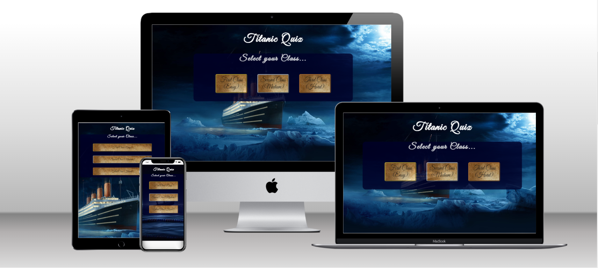
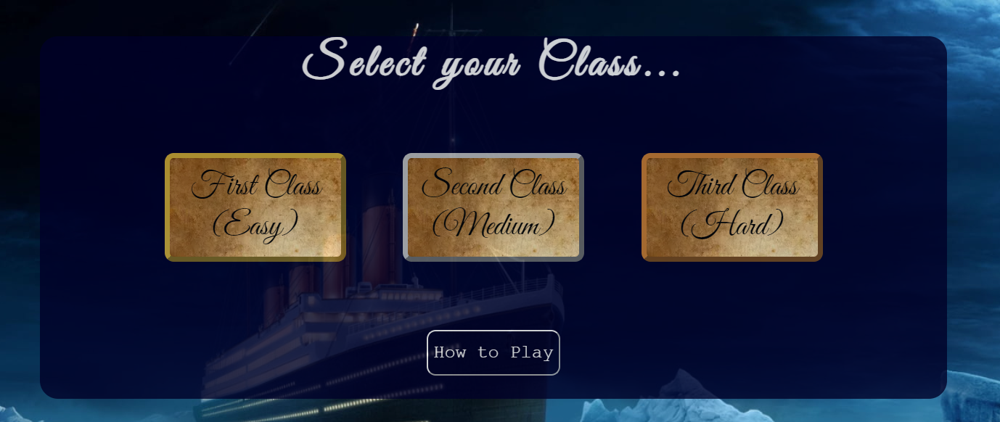
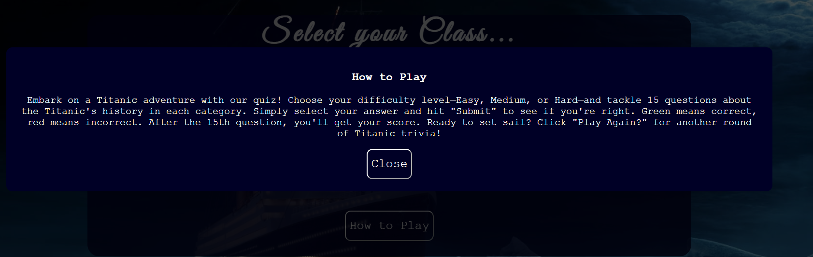
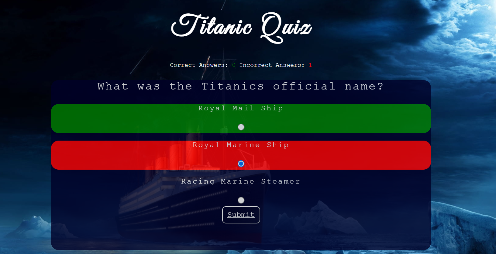
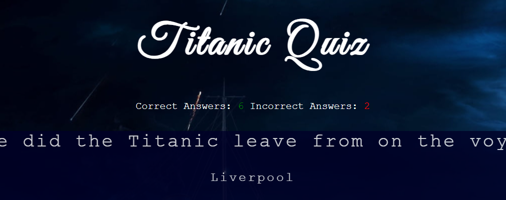
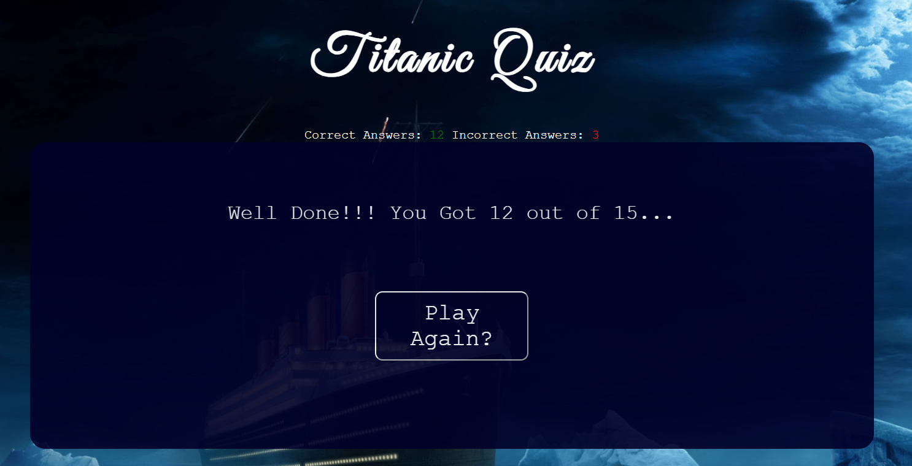
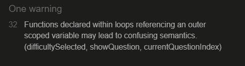
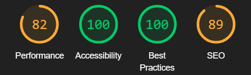

# Titanic Quiz

- Welcome to the Titanic Quiz – an interactive and educational quiz that takes you on a journey through the history of the Titanic, the legendary ocean liner. This quiz offers an engaging way to test your knowledge about the Titanic's fascinating story, from its construction and maiden voyage to its tragic sinking and aftermath.

### Who is the Quiz For?

- The Titanic Quiz is designed for anyone curious about the Titanic's history and eager to challenge their knowledge. Whether you're a history enthusiast, a trivia lover, or simply someone intrigued by the Titanic's story, this quiz is for you. With multiple difficulty levels, you can choose the challenge that matches your expertise, making it suitable for both Titanic aficionados and those looking to learn more.

### What makes the Titanic Quiz special?

- Unlike conventional quiz games, the Titanic Quiz goes beyond simple questions and answers. It offers a unique blend of historical learning and interactive engagement. With carefully curated questions, you'll uncover lesser-known facts about the Titanic's construction, crew, passengers, and the events leading up to its fateful sinking.

## Features

- Welcome to the features section of My Titanic Quiz! Here, we'll take a closer look at the different components that make this quiz experience truly unique. Delve into a world of interactive learning as we explore multiple difficulty levels, an immersive Titanic journey, instant feedback, and progress tracking. The user-friendly interface ensures a seamless experience, while insightful results and a "play again" option making it easy for the user to play again and try and improve their score. This educational yet entertaining platform offers accessible and convenient learning, enabling you to enhance your knowledge of the Titanic's history. Let's dive in and discover how each feature enriches your exploration of the Titanic's captivating story.

### Multiple Difficulty Levels:

- My Titanic Quiz caters to a wide range of users by offering different difficulty levels – easy, medium, and hard. This ensures that both casual learners and dedicated history enthusiasts can enjoy the quiz according to their knowledge and expertise. I have also named the difficuly in relation to the 3 classes on the Titanic, indicating that first class had it easy while the third class passengers had a much bigger challenge in their fight for survival.

### How to Play Pop-Up Feature:

- The Titanic Quiz includes a user-friendly "How to Play" pop-up that offers clear instructions for easy navigation. This feature guides users on how to start, choose difficulty levels, answer questions, and understand the scoring system. Whether you're a Titanic enthusiast or just looking to test your knowledge, this pop-up ensures a seamless experience for all users, providing straightforward guidance to make the most of the quiz.

### Main Game Area and Answer Feedback:

- The central gameplay area of the Titanic Quiz provides users with a straightforward yet captivating experience. As users navigate through the questions, they're presented with multiple-choice answers, making the quiz accessible to a wide range of knowledge levels. A distinctive feature is the immediate feedback system. When an answer is submitted, the chosen option turns either green (for a correct answer) or red (for an incorrect one). Simultaneously, the correct answer is displayed, ensuring users absorb the correct information before moving on. This pragmatic approach enhances user engagement and learning as they progress through the quiz.

### Feedback and Progress Tracking:

- Users not only receive immediate feedback on their answers, including whether they got the question right or wrong, but also a running tally of correct and incorrect answers helps users track their progress and measure their increasing knowledge.

### Insightful Results and Play again button:

- At the end of the quiz, users are presented with their score and a personalized message based on their performance. This adds encouragement and motivation for users to further explore the Titanic's history and get better at the quiz.
- Directly below the score and message users have the option to instantly play the quiz again. This allows them to revisit questions and improve their knowledge over time.
  

### Future Feature: Timed Challenge Mode:

- Incorporating a "Timed Challenge" mode into the Titanic Quiz could elevate the excitement and add a competitive edge to the experience. This feature would present users with a limited amount of time to answer each question. The timer ticking down would create a sense of urgency, encouraging participants to think quickly and make decisions under pressure, much like the real-life scenarios faced on the Titanic. Users who successfully complete the quiz within the allotted time could earn extra points or unlock special achievements. The Timed Challenge mode would attract users seeking an additional level of challenge and thrill, while also catering to those who enjoy testing their knowledge against the clock. This feature aligns with the overall goal of providing a dynamic and engaging quiz experience for a diverse audience.

## Colour Scheme and media:

### Dark Blue Main Divs:

- The deep, dark blue used for the main divs in the project draws inspiration from the serenity of a night sky and the calm waters of the sea. This choice not only evokes a sense of tranquility but also pays homage to the historical setting of the Titanic disaster.

### Night-time Titanic Imagery:

- The images incorporated into the project are all of the Titanic at night, the time when the ill-fated disaster occurred. This visual consistency establishes a connection between the design elements and the historical context, enhancing the storytelling aspect of the project.

### Ancient Paper Background:

- The use of an old paper background for the difficulty buttons adds a vintage touch to the overall design. This subtle detail gives the impression of aged tickets, reminiscent of the time when the Titanic set sail. The combination of modern interactivity and vintage aesthetics creates an intriguing contrast that captures users' attention.

## Testing

- In the process of ensuring the functionality and reliability of my project, I've conducted a thorough testing phase to confirm that all features work seamlessly and contribute to a user-friendly experience. Each feature has been meticulously tested to meet its intended purpose, aligning with the users' goals and expectations. My project provides a streamlined and intuitive interface, guiding users effortlessly towards their objectives.

- Furthermore, I've assessed the compatibility of my project across various browsers and screen sizes. It's essential that the project maintains its integrity and usability regardless of the user's preferred browser or device. Through rigorous testing, I've ascertained that my project maintains its responsiveness and visual appeal, adapting gracefully to different viewing environments.

### Submit Button Bug:

- During the testing phase, I encountered an issue related to the scoring mechanism in my project. Specifically, I found that users were able to increment their score multiple times during the "check answer" process, leading to inaccurate results. This occurred because the "submit" button was not disabled while the answer was being evaluated, allowing users to click it repeatedly before the evaluation was complete.

- To address this bug and ensure accurate scoring, I implemented a solution to disable the "submit" button during the answer evaluation process. By disabling the button temporarily, users are prevented from submitting additional responses until the evaluation is complete and the appropriate feedback has been provided. This solution effectively prevents users from exploiting the scoring mechanism and ensures that their score reflects their actual performance in the quiz

### Validator Testing:

- HTML
  - No errors were returned when passing through the [W3C validator](https://validator.w3.org/nu/?doc=https%3A%2F%2Fcode-institute-org.github.io%2Flove-maths%2F)
- CSS
  - No errors were found when passing through the [(Jigsaw) validator](https://jigsaw.w3.org/css-validator/validator?uri=https%3A%2F%2Fvalidator.w3.org%2Fnu%2F%3Fdoc%3Dhttps%253A%252F%252Fcode-institute-org.github.io%252Flove-maths%252F&profile=css3svg&usermedium=all&warning=1&vextwarning=&lang=en)
- JavaScript

  - No errors were found when passing through the [Jshint validator](https://jshint.com/)

    - The following metrics were returned:

      There are 14 functions in this file.

      Function with the largest signature take 2 arguments, while the median is 0.

      Largest function has 25 statements in it, while the median is 3.5.

      The most complex function has a cyclomatic complexity value of 5 while the median is 2.

  - There were also some warnings when passed through the validator. These warnings primarily stem from the use of features introduced in ECMAScript 6 (ES6), such as const, let, arrow functions, and template literals. These features enhance code readability, maintainability, and performance, I then discovered that you can change the version of Javascript within the Validator which returned only 1 warning.

  

  - The warning indicates that declaring functions within loops that reference external variables might lead to confusion and unexpected behavior due to variable scope interactions.

  - To address this warning, I could restructure the code by passing variables as function parameters or using closures. These approaches help manage scope and reduce potential ambiguity. However, for the sake of simplicity and clarity within this project, I've chosen to keep the current code structure. Although the warning raises a valid concern, I believe the current code layout remains intuitive and suitable for this project's scope.

### Lighthouse Testing:

- To ensure the high quality and optimal performance of my project, I conducted thorough testing using Lighthouse, a powerful tool within Google Chrome Developer Tools. Lighthouse evaluates various aspects of web pages, including performance, accessibility, best practices, and SEO. Based on the Lighthouse results, my project received a performance score of 82, while achieving perfect scores in accessibility (100), best practices (100), and a strong score in SEO (89). By addressing the recommendations provided by Lighthouse, I've fine-tuned my project to deliver a smooth and user-friendly experience, while adhering to industry standards and best practices.

### Unfixed bugs:

- Currently, I have no unfixed bugs in my project.

## Deployment

### The site was deployed using GitHub pages using following steps:

- In the titanic-quiz repository, go to the Settings tab.
- In the source section menu, select the Master Branch,
- When the master branch has been selected, the page will refresh and come up with a notification telling you the deployment has been successful.
- You can find the link for titanic-quiz here - https://eleanorcundall.github.io/titanic-quiz/

## Credits

### Content:

- Fonts used are from Google fonts.
- I used the website Stack Overflow for help and advice throughout the project.
- I used the love maths project to help me with how to increment the score.
- I used Google to help me with some of the quiz questions and answers.
- My mentour Derek McAuley helped me with how to indicate which questions was correct/ incorrect.

### Media:

- Background images taken from https://wallpapersafari.com/
- Images for difficulty buttons taken from https://www.dreamstime.com/
